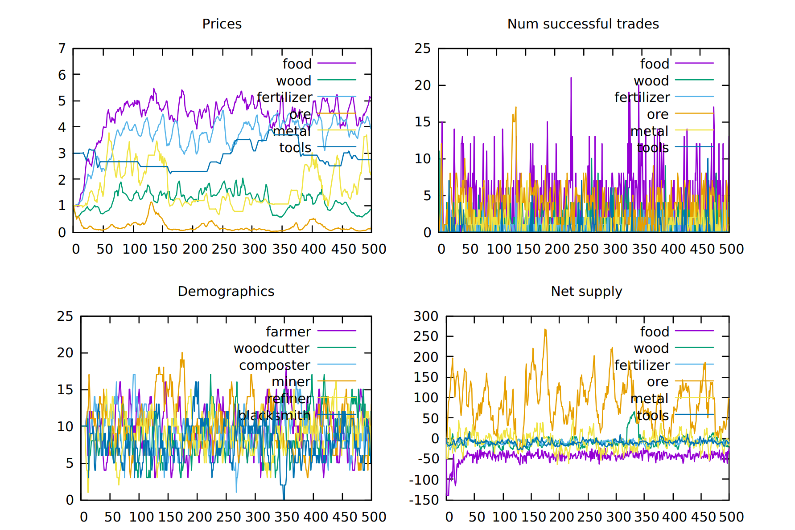
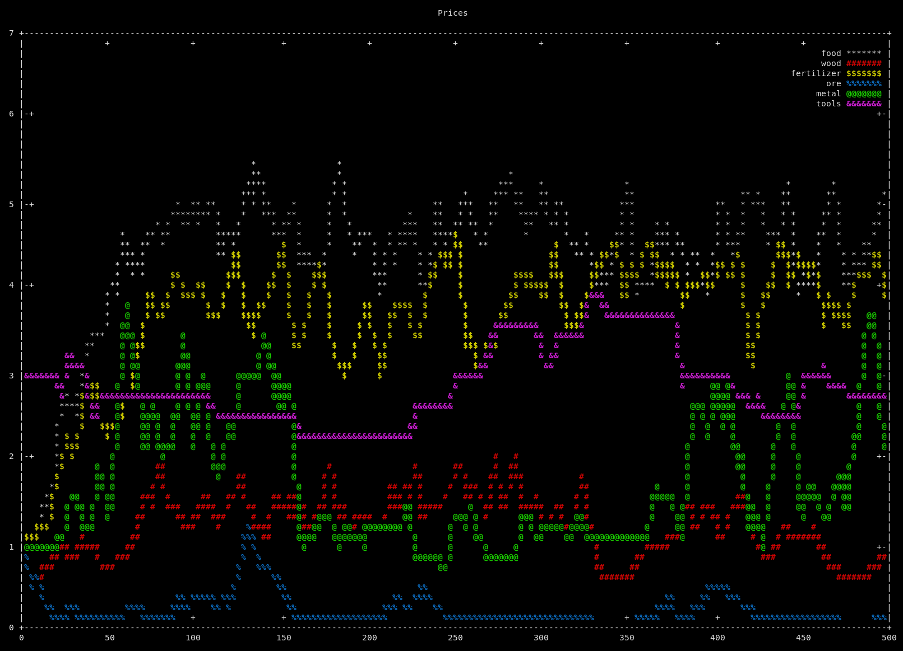

# bazaarBot2
This is a C++ port of a C# port of bazaarBot with some modifications.
The original repo was based on a paper which had some serious issues, many of which were fixed by Vibr8gKiwi in their C# port.
 - Original repo: https://github.com/larsiusprime/bazaarBot
 - C# port: https://github.com/Vibr8gKiwi/bazaarBot2

# Example output
Simulating 100 traders for 500 ticks:
| Qt plot  |  ASCII plot   |
|----------|:-------------:|
|  |   |

# Dependencies
1. Install deps:
 (eg: `sudo apt-get install cmake gnuplot libboost-all-dev `)
2. Copy https://github.com/dstahlke/gnuplot-iostream/blob/master/gnuplot-iostream.h to `/usr/include/`
3. You'll also need to [install gtest](https://www.eriksmistad.no/getting-started-with-google-test-on-ubuntu/) because I haven't yet gotten round to properly disentangling the tests from everything else.

# Build and run
1. `git clone https://github.com/halgriffiths/bazaarBot2.git`
2. `cd bazaarBot2`
3. `cmake --configure .`
4. `cmake --build /path/to/directory/bazaarBot2 --target all`

This gives you 2 executables, `RunTests` and `driver`. The former runs tests (:o) and the latter makes a test run and outputs some graphs/visualisations

~~~bash
$ ./driver   # Popout Qt plot
$ ./driver && ./color_test.sh plot.gnu   # ASCII plot in terminal
~~~
